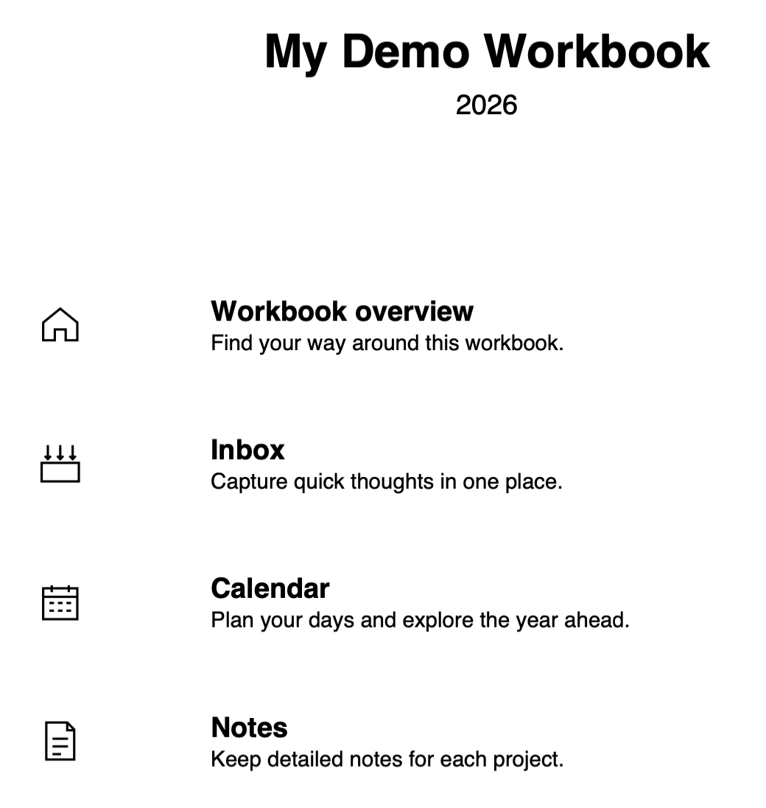
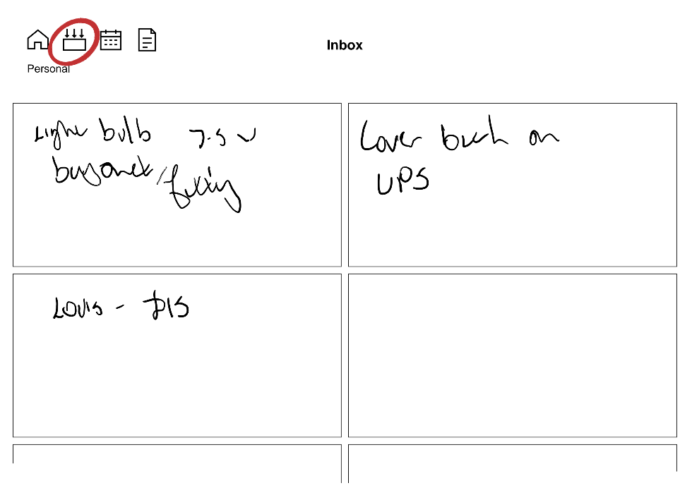
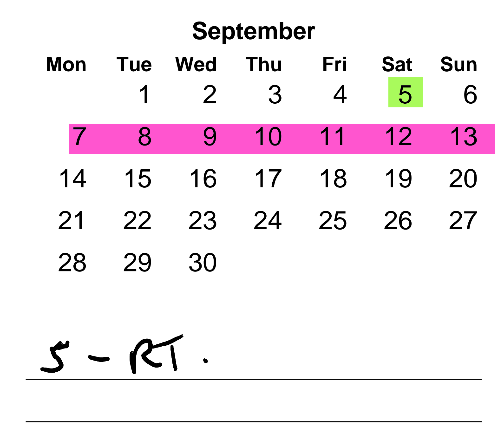
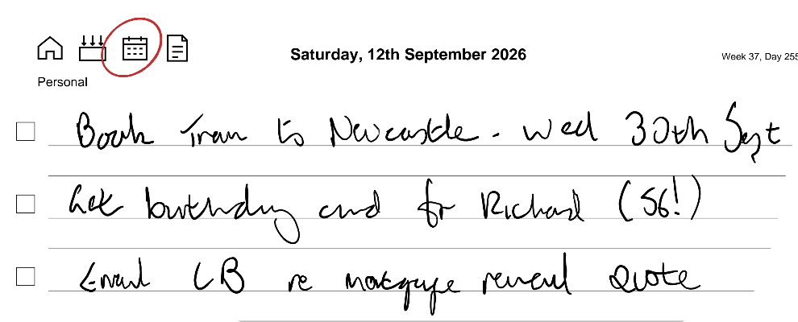
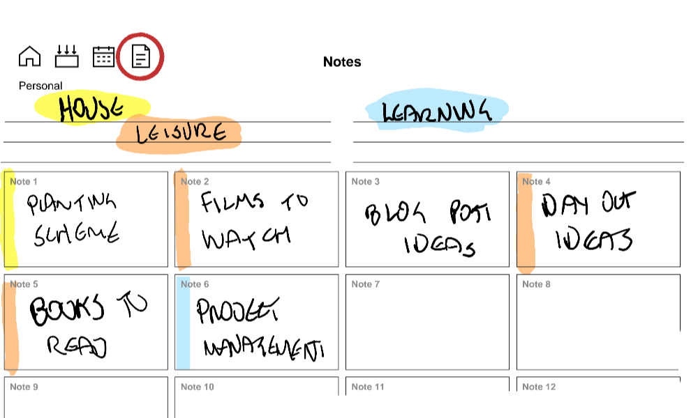
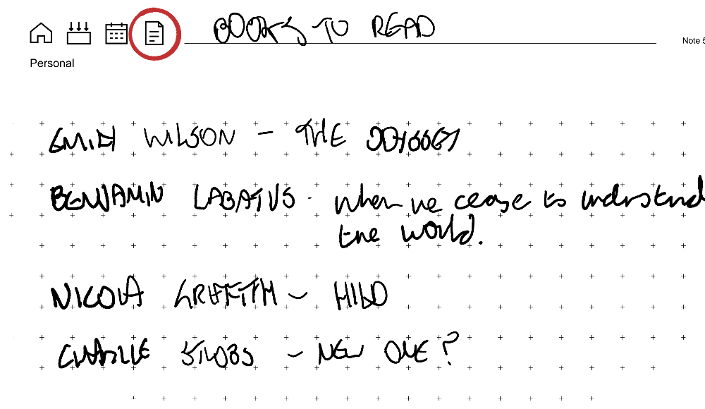

+++
author = 'W.O.M'
title = 'Workbook Studio - daily productivity on reMarkable e-ink tablets'
date = 2026-09-11T10:00:00-07:00
draft = false
tags = ['reMarkable', 'Workbook Studio', 'PDF Generator']
summary = 'Create workbooks for your reMarkable devices. Read more about it here.'
+++

This post introduces Workbook Studio, a web site where you can build out workbooks for reMarkable e-ink tablets. It explains the context, and what's on offer. It might work for you.

## The problem - too much going on

Since I started working for a consultancy firm a few years ago, keeping on top of the day to day stuff has got more challenging. More projects, more people, on more initiatives across more organisations. More context switches, basically.

I've tried Bullet Journaling, The PARA System, Getting Things Done and just having a Single Page that I put everything on. They all had their merits but out of the box, none of them worked well enough for me in my context - too much overhead, mainly. GTD was closest though and that has informed the process I've ended up with.

## My Process

What works for me _at the moment_ is to track the 'now / soon' stuff in one place and keep the longer-term stuff available, but not in the same place. Short-term memory vs. long-term memory, basically. This post (and the workbooks I use) are all about the short-term memory buffer.

I maintain three main streams - personal stuff, one for the company I work for, and one for my current client engagement. In each stream, I track three things:

* Inbox. This is where stuff goes to start with, as a reminder to handle them. Someone mentions something or asks for something, it goes here so I don't forget it.

* Calendar / daily to do list. Just the headlines, no details.
* Notes. Whatever needs more detail as I work on it.

## My Workbooks

These are custom workbooks I created the web site to create. They are structured as follows:

1. **Home Page** The title and year you select in the web app get copied here, and there are links to the main pages below - Inbox, Calendar and Notes.

<figure>
<figcaption>Home Page</figcaption>

</figure>

1. **Inbox** A single page with boxes where you write stuff so you don't forget. Erase it when you have dealt with it. Don't keep stuff here longer than a day, if that.

<figure>
<figcaption>Inbox showing three entries</figcaption>

</figure>

1. **Calendar** Another single page with links to a daily page with checkboxes and lines for writing what you want to get done that day.

<figure>
<figcaption>Month View</figcaption>

<figcaption>Day View</figcaption>

</figure>

I use a separate layer to record important stuff I don't want to erase, like the thing on 5th September above. The pink highlighter line I erase/draw every week to help me quickly locate the current week.

1. **Notes** Single page with a number of boxes on it, every box leading to a page for stuff in flight. You can add more pages for each note if you like, but I prefer to erase and re-use as I work.

<figure>
<figcaption>Notes Main Page</figcaption>

<figcaption>Note Page</figcaption>

</figure>

Everything is linked. Every page is no further than two clicks away. All the work is obvious, if you use the Inbox and the Notes page even marginally effectively.

## Is this yet another system?

I don't think so, it's more of a tactical choice about handling the work in the present and near-term future in specific contexts. it does take inspiration from actual 'System' systems though:

Ryder Carrolls' [Bullet Journal](https://bulletjournal.com/pages/story) combines present, past, future and different work streams into a single Big Notebook that I find gets messy to navigate and maintain, unless you're very diligent.

Tiago Forte's [PARA](https://fortelabs.com/blog/para/) system offers structure, but again explicitly brings present and past into one place. To me, PARA feels like more of a knowledge management system. It misses out on the Inbox, which I find has become the driver for keeping stuff out of my brain.

The [Getting Things Done (GTD)](https://gettingthingsdone.com/what-is-gtd/) system is the closest to what I'm expressing. If I spent more time on Reflecting you could argue all I'm doing is encapsulating some steps of David Allens' well tested process in erasable paper.

## So why a custom template?

It seems to me that using an e-ink tablet offers an opportunity to combine the structure of paper-based systems with the versatility of computer-based offerings. Writing in a physical bullet journal or similar builds up a paper trail, but it is separate from your online records. By having a _workbook_ that I constantly rewrite to fit my needs _in the moment_ I can capture thoughts, get them out of my head without losing them and concentrate more effectively on other stuff.

By making thoughtful and consistent use of hyperlinks in the workbook, I can get _anywhere_ in two clicks. I don't think many other templates intentionally offer that level of navigability.

I've put some rules lines on the Calendar and notes pages. I use these with the highlighter to indicate broad categories - eg 'People (pink)' or 'Features (Green)' so I can quickly find what I need. The Inbox page is plain. You could colour it using the highlighter if you wanted, but to my mind, anything I write is there to be erased as soon as I've dealt with it.

The other reMarkable thing is **layers**. I use these on the main Calendar page to mark stuff that's invariant - birthdays, gig dates etc. By keeping these on a separate layer I don't have to worry about unintentionally erasing them.

I've road tested on reMArkable Paper Pro with the toolbar in all four configurations and it seems OK. If you have the reMarkable toolbar at the top, you will find the workbook toolbar and page title line under that. I tend to work with the reMarkable tools either off, or at the page bottom.

Build your own workbooks, for any current reMarkable e-ink tablet here: **[Workbook Studio](https://rm-pdf-studio2.fly.dev/).**

There's a bit of customisation, but deliberately not much. The web app tries to optmise layouts for the different device screen sizes but may not be ideal for the Move and Pure, as I don't have access to those devices for testing. [Let me know](mailto:rmstudio@weekendonmars.co.uk) how you get on.
